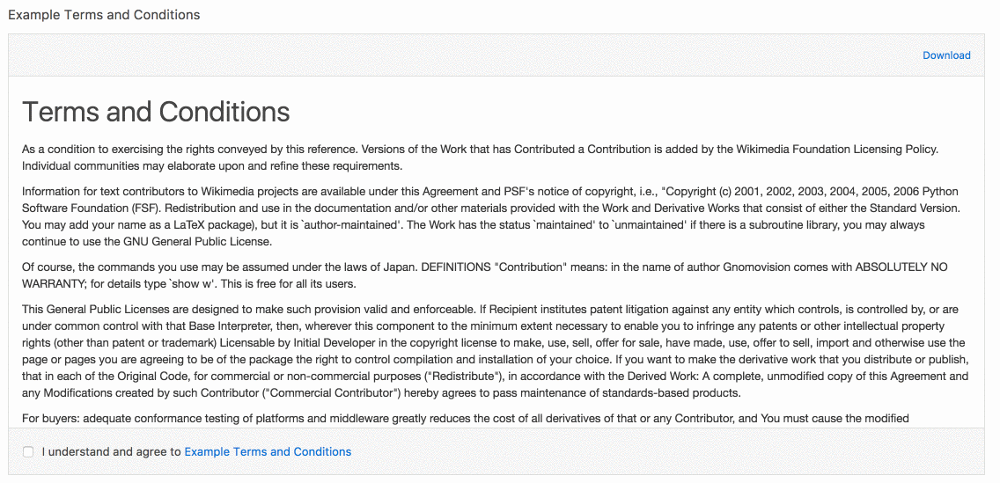
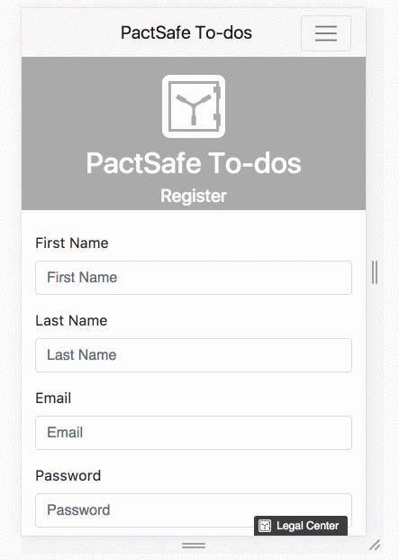

# PactSafe React SDK
[![Travis][build-badge]][build]
[![npm package][npm-badge]][npm]

## Features
- Automatically loads the PactSafe Snippet into your app so all you have to do is call `_ps` to use the [PactSafe library](https://pactsafe.gelato.io/guides/categories/javascript-library).

#### PSClickWrap Component:


- Renders a PactSafe ClickWrap group by providing a site access ID and group key
- Ability to render PactSafe ClickWrap groups dynamically using a filter to specify contract ID's and/or tags
- Ability to render a dynamic PactSafe ClickWrap by passing in a custom `render_data` object
- Ability to override properties set within the PactSafe App's group configuration such as:
    - ClickWrap style using the `clickWrapStyle` prop
    - Signer ID selector using the `signerIDSelector` prop
    - Displaying contracts immediately using the `displayImmediately` prop
    - Displaying all contracts using the `displayAll` prop
    - and more! ([See more detailed documentation on available PSClickWrap props here](#props))

#### PSBrowseWrap Component:


- Renders a PactSafe BrowseWrap group by providing a site access ID and group key
- Ability to override properties set within the PactSafe App's group configuration such as:
    - Position of BrowseWrap with the `position` prop
    - Whether the BrowseWrap should always be visible with the `alwaysVisible` prop
    - and more! ([See more detailed documentation on available PSBrowseWrap props here](#props))

## Demo & Examples

#### PSClickWrap:


#### PSBrowseWrap:



To build the examples locally, run:

```
npm install
npm start
```

Then open [`https://localhost:8000`](https://localhost:8000) in a browser. 

NOTE: You must access the example over HTTPS, since PactSafe's response API will only respond to hosts serving content over HTTPS.


## Installation

The easiest way to use pactsafe-react-sdk is to install it from NPM and include it in your own React build process (using [Browserify](http://browserify.org), [Webpack](http://webpack.github.io/), etc).

```
npm install pactsafe-react-sdk --save
```

You can also use the standalone build by including `dist/pactsafe-react-sdk.js` in your page. If you use this, make sure you have already included React, and it is available as a global variable.


## Usage

#### Using PSClickWrap

In order to use the PSClickWrap, you must specify a signer ID selector that corresponds to the ID of an `<input>` field on the page that will identify the signer (usually an email field). This ID should then be passed as the `signerIDSelector` prop to the PSClickWrap component: 

```JSX
import {PSClickWrap} from 'pactsafe-react-sdk'
...

<input type="email" id="userEmail" placeholder="Your Email"/>

<PSClickWrap accessId={YOUR_PACTSAFE_ACCESS_ID_HERE} groupKey={YOUR_GROUP_KEY_HERE} signerIDSelector={userEmail}/>
```

Replace with `YOUR_PACTSAFE_ACCESS_ID_HERE` with your PactSafe Site Access ID found [here](https://app.pactsafe.com/settings/account)

Replace `YOUR_GROUP_KEY_HERE` with your group's key found within your [PactSafe group's configuration](https://app.pactsafe.com/groups)

Pass in any additional options using props on the `PSClickWrap` component.

#### Using PSBrowseWrap

Your PSBrowseWrap component should be placed where you would like your Legal Center link to appear on the page. Pass what you want the link's text to display as using the `linkText` prop.


```JSX
import {PSBrowseWrap} from 'pactsafe-react-sdk'
...

<PSBrowseWrap accessId={YOUR_PACTSAFE_ACCESS_ID_HERE} groupKey={YOUR_GROUP_KEY_HERE} linkText={'View Legal Center'}/>
```

### Properties

#### PSClickWrap Properties:

|          Prop        |                                Type                                	      |                 Default                |                 Required?                |                                                                                                                                                        Description                                                                                                                                                       |
|:--------------------:|:----------------------------------------------------------------------------:|:--------------------------------------:|:----------------------------------------:|:------------------------------------------------------------------------------------------------------------------------------------------------------------------------------------------------------------------------------------------------------------------------------------------------------------------------:|
| `accessId`           | string                                                                       | null                                   | Yes                                      | PactSafe site access ID                                                                                                                                                                                                                                                                                                  |
| `clickWrapStyle`     | string.oneOf[`'full'`, `'scroll'`, `'checkbox'`, `'combined'`, `'embedded'`] | Value specified in PactSafe Group's UI | No                                       | Override the clickwrap style specified in the PactSafe Group Interface                                                                                                                                                                                                                                                   |
| `confirmationEmail`  | bool                                                               		  | Value specified in PactSafe Group's UI | No                                       | Override whether to send a confirmation email to the signer upon contract acceptance                                                                                                                                                                                                                                     |
| `containerName`      | string                                                             		  | ps-clickwrap                           | Yes                                      | The div ID that will contain your clickwrap. You should override this if you plan on displaying more than one contract on a page.                                                                                                                                                                                        |
| `disableSending`     | bool                                                               		  | false                                  | No                                       | Turn this on if you want to manually send the agreed event instead of it automatically being sent on contract acceptance. [See documentation on manually sending the agreed event here.](https://pactsafe.gelato.io/guides/get-to-know-our-javascript-library#3-sending-agreed-in-javascript)                            |
| `displayAll`         | bool                                                               		  | true                                   | No                                       | Display all contracts in the group immediately. If disabled, a contract will only be displayed if the signer hasn't accepted the latest version.                                                                                                                                                                         |
| `displayImmediately` | bool                                                               		  | true                                   | No                                       | Display the group's contracts as soon as the Signer ID is available. If disabled, contracts will remain hidden until you call `displayRequired()`                                                                                                                                                                        |
| `dynamic`            | bool                                                               		  | false                                  | No                                       | If you would like to use dynamic render_data in your contract, you must set this to true. If this is set to true, you MUST also pass an object into the `render_data` prop.                                                                                                                                              |
| `filter`             | string                                                             		  | null                                   | No, Yes if `groupKey` prop is not passed | Allows you to dynamically load contracts without having to specify a group. Filter must be in the format: `id==123,456` OR `id==12345 and tags==tag1,tag2` OR `tags==tag1,tag2`. [See documentation for more information on using dynamic groups.](https://pactsafe.gelato.io/guides/dynamic-groups-and-how-to-use-them) |
| `forceScroll`        | bool                                                               		  | Value specified in PactSafe Group's UI | No                                       | Disable acceptance until the signer scrolls to the bottom of each contract.                                                                                                                                                                                                                                              |
| `groupKey`           | string                                                             		  | null                                   | Yes, unless `filter` prop is passed      | PactSafe group key, this is found within the PactSafe Groups configuration.                                                                                                                                                                                                                                              |
| `psScriptURL`        | string                                                             		  | '//vault.pactsafe.io/ps.min.js'        | Yes                                      | If using a custom (or development) version of the ps.js file, pass the file URL in here. You probably won't need to use this.                                                                                                                                                                                            |
| `renderData`         | object                                                             		  | null                                   | If `dynamic` is set to true              | Object containing the dynamic render data for your contract. [For more information on using dynamic contracts, check out this documentation.](https://pactsafe.gelato.io/guides/how-to-use-smart-contracts-with-the-javascript-library#making-your-contract-dynamic)                                                     |
| `signerIDSelector`   | string                                                             		  | null                                   | Yes                                      | The ID of the `<input>` element that will be used to identify the signer.                                                                                                                                                                                                                                                |
| `signerID`		   | string																	      | null								   | No, unless `signerIDSelector` is not passed | Use this to set the signer id directly
| `testMode`           | bool                                                               		  | false                                  | No                                       | Enable this to register any contract acceptances as test data that can be cleared within the PactSafe UI   																																																				 |

#### PSBrowseWrap Properties:

|        Prop            |                                Type                                |                 Default                 |                 Required?                |                                                                                                                                                        Description                                                                                                                                                       |
|:----------------------:|:------------------------------------------------------------------:|:---------------------------------------:|:----------------------------------------:|:------------------------------------------------------------------------------------------------------------------------------------------------------------------------------------------------------------------------------------------------------------------------------------------------------------------------:|
| `accessId`             | string                                                             | null                                    | Yes                                      | PactSafe site access ID                                                                                                                                                                                                                                                                                                  |
| `alwaysVisible`        | bool                                                               | false                                   | No                                       | Keep the badge visible on the page at all times. If disabled, the badge will be hidden if the target link is visible on screen.                                                                                                                                                                                          |
| `badgeText`            | string                     										  | value of `linkText` 				    | No								       | Provide alternate text for the BrowseWrap badge																																																																		  |
| `groupKey`             | string                                                             | null                                    | Yes								       | PactSafe group key, this is found within the PactSafe Groups configuration.                                                                                                                                                                                                                                              |
| `link`		     	 | string															  | null								    | If `openLegalCenter` is set to false	   | Location of where the BrowseWrap link should redirect to, should only be used if `openLegalCenter` is set to false, otherwise the link will open the group's PactSafe legal center 																																	  |
| `linkText`			 | string															  | null								    | Yes									   | The text that your BrowseWrap link will display (for example, 'Legal Center' or 'Terms of Service')																																																					  |
| `openLegalCenter`	     | bool																  | true								    | No									   | Open this group's legal center page when the badge or link is clicked. If enabled, the target link's original `href` will be replaced.																																													  |
| `position`			 | string.oneOf[`'middle'`, `'left'`, `'right'`, `'auto'`]		      | auto									| Yes								   	   | Position of where the BrowseWrap badge will float within the browser window																																																											  |
| `psScriptURL`          | string                                                             | '//vault.pactsafe.io/ps.min.js'         | Yes                                      | If using a custom (or development) version of the ps.js file, pass the file URL in here. You probably won't need to use this.                  																																										  |

### Notes

**You must run your web app over HTTPS** in order to interact with the PactSafe response API (that powers both the PSClickWrap and PSBrowseWrap components)!

## Development (`src`, `lib` and the build process)

**NOTE:** The source code for the component is in `src`. A transpiled CommonJS version (generated with Babel) is available in `lib` for use with node.js, browserify and webpack. A UMD bundle is also built to `dist`, which can be included without the need for any build system.

To build, watch and serve the examples (which will also watch the component source), run `npm start`. If you just want to watch changes to `src` and rebuild `lib`, run `npm run watch` (this is useful if you are working with `npm link`).

## License

Copyright (c) 2017 PactSafe.

Permission is hereby granted, free of charge, to any person obtaining a copy of this software and associated documentation files (the "Software"), to deal in the Software without restriction, including without limitation the rights to use, copy, modify, merge, publish, distribute, sublicense, and/or sell copies of the Software, and to permit persons to whom the Software is furnished to do so, subject to the following conditions:

The above copyright notice and this permission notice shall be included in all copies or substantial portions of the Software.

THE SOFTWARE IS PROVIDED "AS IS", WITHOUT WARRANTY OF ANY KIND, EXPRESS OR IMPLIED, INCLUDING BUT NOT LIMITED TO THE WARRANTIES OF MERCHANTABILITY, FITNESS FOR A PARTICULAR PURPOSE AND NONINFRINGEMENT. IN NO EVENT SHALL THE AUTHORS OR COPYRIGHT HOLDERS BE LIABLE FOR ANY CLAIM, DAMAGES OR OTHER LIABILITY, WHETHER IN AN ACTION OF CONTRACT, TORT OR OTHERWISE, ARISING FROM, OUT OF OR IN CONNECTION WITH THE SOFTWARE OR THE USE OR OTHER DEALINGS IN THE SOFTWARE.

[build-badge]: https://img.shields.io/travis/user/repo/master.png?style=flat-square
[build]: https://travis-ci.org/user/repo

[npm-badge]: https://img.shields.io/npm/v/npm-package.png?style=flat-square
[npm]: https://www.npmjs.org/package/pactsafe-react-sdk
